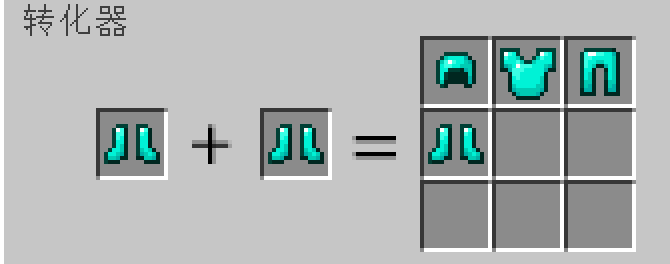
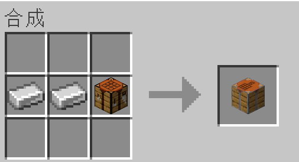

# 可选择的转换器
这是一个我的世界的模组。  
可以将任意两件装备合成为其他相同材质的装备。  
灵感来自于，我在其他mod中打boss总是没有掉落到我想要的装备部位！  

合成表  

可以自行制作数据包，参考datapacks目录

# Selectable Convertor 
This is a module of my world.  
Any two pieces of equipment can be combined into other equipment of the same material.  
Inspired by the fact that I never dropped the equipment I wanted when fighting bosses in other mods!  

crafting table  

To make your own packets, refer to the datapacks directory